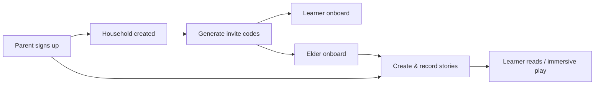

# Fable

**Intergenerational storytelling for Kinyarwanda language and cultural continuity.**

Fable is a family-centered Progressive Web App that connects **parents**, **learners**, and **elders** through shared stories. Elders record and craft narratives; parents manage the household and approve access; children explore stories in a gesture-friendly reader—including optional immersive 3D playback with characters, environments, weather, and lip sync.

> Heritage language learning should feel like sitting with family—not like a textbook.

---

## Why Fable?

Languages fade when stories stop being told. Fable keeps Kinyarwanda alive by making storytelling a shared family practice:

| Generation | Role in Fable |
|------------|---------------|
| **Elders** | Author and narrate cultural stories, sentence by sentence |
| **Parents** | Create the household, invite members, curate the library |
| **Learners** | Read, listen, and step into immersive story worlds |

Built for families first—with parental consent, invitation-only onboarding for kids and elders, and an offline-oriented design for unreliable connectivity.

---

## Features

### Family & safety
- **Three roles** — Parent, Learner (kid), and Elder (author), each with dedicated dashboards and permissions
- **Invitation-based onboarding** — Kids and elders join via one-time, expiring codes; parents approve pending learners
- **Household isolation** — Stories and members stay scoped to the family unit

### Storytelling
- **Multiple creation paths** — Manual authoring, quick-story flows, and AI-assisted generation (Claude)
- **Sentence-level audio** — Elders record narration per sentence; audio lives in Supabase Storage
- **Bilingual content** — English + Kinyarwanda sentence fields, themes, and immersive hotspot notes
- **Kid-friendly reader** — Gesture-oriented reading experience with audio playback
- **Waruziko** — Daily Rwandan culture facts for learners (Kinyarwanda + English)
- **Mid-story questions** — Learners can ask family a question during a story; parents answer from the dashboard
- **Synced reading shelf** — Kid library shows new / reading / finished stories from the same activity logs as the parent dashboard

### Immersive 3D worlds
- **Three.js scenes** — Environments (forest, home, village, school, market) with characters and props
- **Living scenes** — Time of day, weather effects, ambient sound, and scene events per sentence
- **Character presence** — Appearance editing, idle motion, reaction gestures, and Rhubarb-style lip sync
- **Cultural hotspots** — Tap props for bilingual notes that deepen the story world

### Platform
- **Offline-first direction** — RxDB schema for local sync (PWA-oriented)
- **Role-gated routes** — Middleware protects `/parent/*`, `/kid/*`, and `/elder/*`

---

## How it works



1. **Parent** creates an account and household at `/auth/signup`
2. **Parent** invites learners and elders from `/parent/family`
3. **Family members** join at `/auth/onboard` with a valid code
4. **Elders / parents** write stories, record audio, and optionally configure immersive scenes
5. **Learners** open stories in the reader or step into 3D immersive playback

---

## Tech stack

| Layer | Technologies |
|-------|-------------|
| App | [Next.js 16](https://nextjs.org) (App Router), React 19, TypeScript |
| UI | Tailwind CSS 4 |
| Auth | [NextAuth v5](https://authjs.dev) + Supabase Auth |
| Database & storage | [Supabase](https://supabase.com) (PostgreSQL + Storage) |
| Immersive 3D | Three.js, React Three Fiber, `@react-three/drei`, postprocessing |
| AI | Anthropic Claude (story generation & expansion) |
| Client state | Zustand, TanStack React Query |
| Offline | RxDB |

---

## Getting started

### Prerequisites

- **Node.js 20+**
- A [Supabase](https://supabase.com) project
- *(Optional)* An [Anthropic](https://anthropic.com) API key for AI story generation

### 1. Clone and install

```bash
git clone <your-repo-url>
cd fable
npm install
```

### 2. Environment variables

```bash
cp .env.example .env.local
```

Fill in `.env.local`:

```env
# Supabase
NEXT_PUBLIC_SUPABASE_URL=https://your-project.supabase.co
NEXT_PUBLIC_SUPABASE_ANON_KEY=your_anon_key
SUPABASE_SERVICE_ROLE_KEY=your_service_role_key

# NextAuth (Auth.js)
NEXTAUTH_SECRET=          # openssl rand -base64 32
NEXTAUTH_URL=http://localhost:3000

# Optional — AI story generation
ANTHROPIC_API_KEY=sk-ant-...
# ANTHROPIC_MODEL=claude-sonnet-4-6
```

For production hosts (e.g. Railway), see [`.env.production.example`](./.env.production.example).

### 3. Database setup

Run the SQL scripts in your Supabase SQL Editor, in order:

1. Base auth & household tables — see [SETUP_GUIDE.md](./SETUP_GUIDE.md)
2. [`supabase/auth_schema.sql`](./supabase/auth_schema.sql) — account status, role normalization
3. [`supabase/stories_schema.sql`](./supabase/stories_schema.sql) — stories, sentences, audio, interaction logs
4. [`supabase/immersive_schema.sql`](./supabase/immersive_schema.sql) — 3D environments, characters, animation data
5. [`supabase/waruziko_schema.sql`](./supabase/waruziko_schema.sql) — Waruziko facts, views, and mid-story kid questions

Also apply any files under [`supabase/migrations/`](./supabase/migrations/) if present.

### 4. Run locally

```bash
npm run dev
```

Open [http://localhost:3000](http://localhost:3000).

---

## Roles & routes

| Role | How they join | Home | What they can do |
|------|---------------|------|------------------|
| **Parent** | `/auth/signup` | `/parent/dashboard` | Manage family, invite members, create & curate stories |
| **Learner** | `/auth/onboard` (invite code) | `/kid/library` | Read and explore family stories |
| **Elder** | `/auth/onboard` (invite code) | `/elder/dashboard` | Create, edit, and record stories |

### Useful paths

| Route | Description |
|-------|-------------|
| `/` | Marketing landing page |
| `/auth/signin` | Sign in (all roles) |
| `/parent/family` | Invite and manage household members |
| `/parent/library` | Parent story library |
| `/parent/create-story` | Parent story creation |
| `/parent/quick-story` | Quick AI story flow |
| `/elder/create-story` | Elder story studio |
| `/elder/story/[id]/edit-sentences` | Sentence editing & audio recording |
| `/kid/library` | Learner shelf (new / reading / finished) |
| `/kid/waruziko` | Fact of the day (Waruziko) |
| `/kid/story/[id]` | Learner immersive story reader |
| `/*/story/[id]/immersive` | Immersive 3D playback (parent / kid / elder) |

Middleware enforces role-based access on `/parent/*`, `/kid/*`, and `/elder/*`.

---

## Project structure

```
src/
├── app/                      # Next.js App Router
│   ├── api/                  # REST: auth, stories, Claude, parent
│   ├── auth/                 # Sign in, sign up, onboard, pending
│   ├── parent/               # Dashboard, family, library, story tools
│   ├── kid/                  # Library & story reader
│   ├── elder/                # Dashboard & story studio
│   └── dashboard/            # Shared post-login entry
├── components/
│   ├── immersive/            # 3D canvas, characters, wizard, weather, hotspots
│   ├── story/                # Reader, preview, audio recorder
│   ├── parent/               # Parent shell / layout chrome
│   └── auth/                 # Auth UI shells & forms
├── lib/
│   ├── immersive/            # Scene specs, presets, lip sync, gestures, server helpers
│   ├── stories-server.ts     # Story persistence
│   ├── claude.ts             # AI story generation
│   └── supabase*.ts          # DB clients & helpers
├── auth.ts                   # NextAuth configuration
└── middleware.ts             # Route protection & role redirects

supabase/                     # SQL schemas & migrations
```

---

## API overview

Key routes under `src/app/api/`:

| Method | Path | Purpose |
|--------|------|---------|
| `POST` | `/api/auth/signup` | Parent account creation |
| `POST` | `/api/auth/onboard` | Join via invitation |
| `POST` | `/api/auth/validate-invitation` | Validate invite code |
| `GET` / `POST` | `/api/stories` | List / create stories |
| `GET` / `PATCH` | `/api/stories/[id]` | Story detail & updates |
| `GET` / `PUT` | `/api/stories/[id]/immersive` | Immersive scene config |
| `POST` | `/api/claude/generate-story` | AI story generation |
| `POST` | `/api/claude/expand-story` | AI story expansion |
| `POST` | `/api/parent/invite` | Create invitation |
| `POST` | `/api/parent/approve` | Approve pending learner |
| `GET` | `/api/parent/family` | Household members |
| `GET` | `/api/parent/activity` | Family activity |

Database helper details: [SUPABASE_API_REFERENCE.md](./SUPABASE_API_REFERENCE.md).

---

## Scripts

```bash
npm run dev      # Development server
npm run build    # Production build
npm run start    # Serve production build
npm run lint     # ESLint
```

---

## Documentation

| Guide | Contents |
|-------|----------|
| [SETUP_GUIDE.md](./SETUP_GUIDE.md) | Full auth & Supabase setup walkthrough |
| [FAMILY_ROLES_GUIDE.md](./FAMILY_ROLES_GUIDE.md) | Invitation flow & role permissions |
| [PARENTAL_CONSENT_GUIDE.md](./PARENTAL_CONSENT_GUIDE.md) | Parent-controlled account creation |
| [SUPABASE_API_REFERENCE.md](./SUPABASE_API_REFERENCE.md) | Supabase helper functions |

---

## Deployment

Configured for [Railway](https://railway.app) (see [`.railwayrc.json`](./.railwayrc.json)).

1. Create a Railway (or similar) service from this repo
2. Set env vars from [`.env.production.example`](./.env.production.example) — especially `NEXTAUTH_URL` to your public URL
3. Deploy with:

```bash
npm run build && npm run start
```

Ensure Supabase Auth redirect URLs and storage policies match your production domain.

---

## Design principles

- **Family-first** — Parents gatekeep access; kids never self-register into a household
- **Heritage over hype** — Kinyarwanda is a first-class content surface, not an afterthought
- **Story as product** — Reading, listening, and immersive play share one narrative model
- **Resilience** — Offline-oriented architecture for real-world connectivity constraints

---

## License

Private project (`"private": true` in `package.json`). All rights reserved unless otherwise stated by the maintainers.
